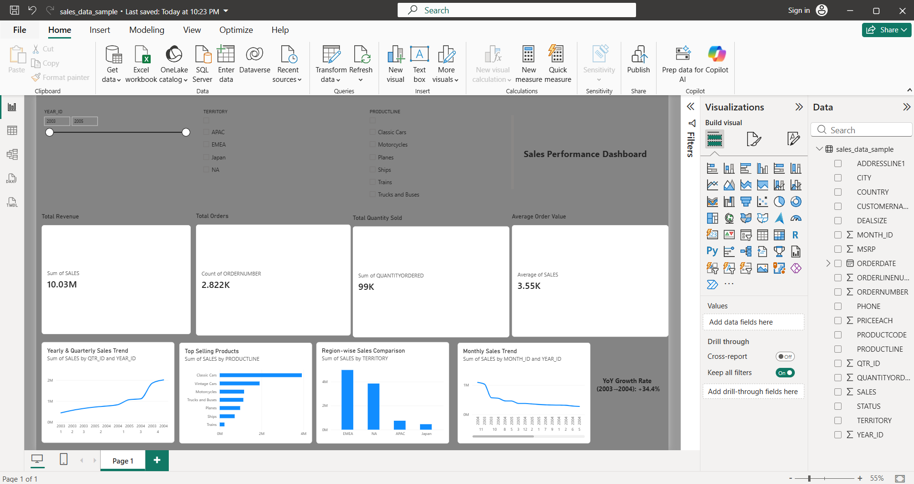

# Sales Performance Dashboard

This is a project I built to practice the full data analytics workflow — starting from a messy raw dataset and ending up with an interactive Power BI dashboard.

## Why I built this

I wanted to actually go through the process a data analyst would go through — not just make a chart, but clean the data myself, figure out what questions to ask, and then build something that actually answers them. So I picked a sales transactions dataset and worked through it step by step in Excel first, then brought everything into Power BI to make it interactive.

## Tools

- Excel (for cleaning the data and building pivot tables to explore it)
- Power BI Desktop (for the actual dashboard)

## What I did

**1. Cleaned the data**
Checked for duplicate rows and blank/null values. Turns out the dataset I picked didn't have duplicates, which was surprising but nice. Some columns like state, postal code, and address line 2 had a lot of blanks — but that's normal, since a lot of the orders were international and don't need those fields. I dropped columns that were just customer contact info (phone, name, address) since they weren't useful for the sales analysis.

**2. Looked at trends over time**
Built pivot tables to see sales by month, quarter and year. The thing that stood out immediately — every single year, Q4 sales jump way up compared to the rest of the year. Makes sense, holiday season buying. Also noticed 2005 had way less total revenue than 2003/2004, which looked bad at first, but then I realized the dataset just doesn't have data for the second half of 2005 — it's not actually a decline, the year is just incomplete.

**3. Which products and regions perform best**
Grouped sales by product line — Classic Cars are by far the best seller, Trains barely sell anything in comparison. Did the same for region — EMEA brings in the most revenue, Japan the least.

**4. KPIs**
- Total Revenue: ~$10.03M
- Total Orders: 2,822
- Total Quantity Sold: 99,037
- Average Order Value: ~$3,554
- Growth Rate 2003 to 2004: +34.4%

One thing I couldn't do — the dataset doesn't have any cost or profit data in it, just sales price. So I skipped a "profit" KPI instead of making one up or faking it with a rough estimate. Better to leave it out than show a number that doesn't mean anything.

**5. Dashboard**
Brought the cleaned data into Power BI and built out:
- KPI cards up top (revenue, orders, quantity, AOV)
- A trend line for monthly and quarterly/yearly sales
- A bar chart ranking product lines
- A bar chart comparing regions
- Slicers so you can filter by year, region, or product line and watch everything update

## What's in this repo

- sales_data_sample.csv — the original raw data
- the Excel file — cleaned data + all the pivot tables I used to figure out the trends
- the .pbix file — the actual Power BI dashboard
- dashboard-screenshot.png — screenshot of the finished dashboard

## To open it

You'll need Power BI Desktop (it's free) to open the .pbix file and actually play around with the slicers yourself.

---
Still learning, so if you spot something I could've done better with the data or the dashboard, feel free to let me know.
